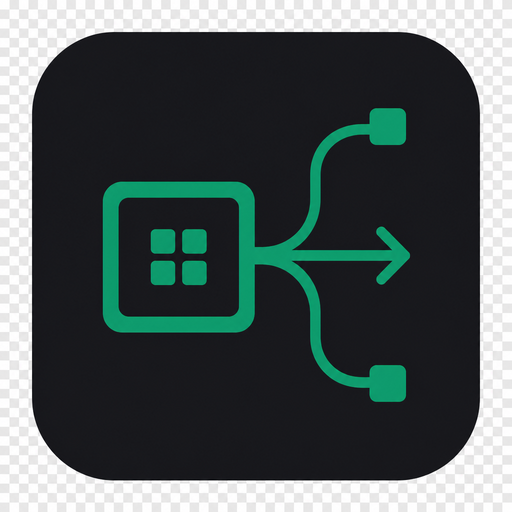

<p align="center">
  
</p>

<h1 align="center">Keylane</h1>

<p align="center">
  <strong>A personal assistant that lives on your desktop, not in a browser tab</strong><br />
  Press Super+Space. A small model on your Intel NPU does the job — or hands it to a bigger AI and checks the result.
</p>

<p align="center">
  <a href="#quick-start">Quick start</a> ·
  <a href="#how-it-works">How it works</a> ·
  <a href="#what-it-can-do">Capabilities</a> ·
  <a href="docs/PLUGINS.md">Plugins</a> ·
  <a href="docs/THEMES.md">Themes</a> ·
  <a href="docs/INDEX.md">Handbook</a>
</p>

---

## What is Keylane?

Press **Super+Space** and a Spotlight-style bar appears. Type or dictate what you
want. A small OpenVINO model on the Intel **NPU** decides what to do with it:

- **Does it itself** — opens an application, searches the web, reads a file,
  checks the battery, copies to the clipboard, sends an email, runs an
  allowlisted command.
- **Delegates what it cannot** — repository work goes to Claude Code or Cursor,
  images to ComfyUI, long-form writing to LM Studio.
- **Follows up** — inspects the evidence that came back and, if the work is wrong
  or incomplete, tries again with corrective feedback before answering you.

Everything runs on your machine. The gateway binds to `127.0.0.1` and nothing
leaves it unless you enable a cloud worker.

```text
        Super+Space
             │
             ▼
   ┌───────────────────┐    the active theme decides whether this is a
   │  Keylane popup    │    bar, a panel, a full window or a corner orb
   └─────────┬─────────┘
             │  text · microphone
             ▼
   ┌───────────────────┐
   │  FastAPI gateway  │  127.0.0.1:9100     ← the authority
   └─────────┬─────────┘
             │
             ▼
   ┌───────────────────┐
   │  NPU assistant    │  plan → act → observe
   └────┬─────────┬────┘
        │         │
   own tools   delegate
        │         │
        │         ▼
        │   ┌──────────────────────────────┐
        │   │ LM Studio · Claude Code ·    │
        │   │ Cursor · ComfyUI · plugins   │
        │   └──────────────┬───────────────┘
        │                  │  evidence
        │                  ▼
        │        ┌───────────────────┐
        └───────▶│   NPU verifier    │  is this actually done?
                 └─────────┬─────────┘
                           │
                  success  │  retry with feedback
                           ▼
                      answer to you
```

**The gateway is the authority, not the model.** Models emit structured intents;
Python validates them against a schema, checks them against your policy,
executes them, and collects evidence. There is no path from model output to a
shell.

## What it can do

Out of the box the assistant has twenty built-in tools, and every plugin adds
more — enabling the ComfyUI MCP plugin alone contributes around forty.

| Area | Tools |
| --- | --- |
| Desktop | Launch apps, open URLs and files, notifications, clipboard, media keys, volume |
| Web | Search (DuckDuckGo or your own SearXNG), fetch and read a page |
| Files | List, read, write and search — sandboxed to your project roots |
| System | Host/battery/disk info, allowlisted shell commands |
| Communication | Send email through your SMTP account |
| Delegation | Hand work to any configured AI worker, then verify the result |

Every tool carries a danger level, and the gateway decides what needs your
approval — reads run freely, anything that changes something asks first.

See [Tools](docs/TOOLS.md) for the full list and how to add your own.

## Everything is a plugin, and nothing is installed by default

A fresh Keylane talks to nothing. Claude Code, Cursor, ComfyUI, LM Studio and
Lemonade all live in [`plugins/catalog/`](plugins/catalog) and are installed
only when you ask — so you decide what your machine reaches out to.

Once installed, a plugin can be enabled, configured or removed while the
gateway is running, and can contribute any combination of:

- a **worker** that can be handed a whole task,
- **tools** the assistant may call directly,
- **skills** that extend its instructions.

If your tool already speaks [MCP](https://modelcontextprotocol.io), wrapping it
is one form in the control panel — its tools are discovered automatically and
appear to the assistant immediately.

See [Writing plugins](docs/PLUGINS.md).

## Themes reshape the popup

A theme is more than a palette. Its `[popup]` section decides the popup's
**shape**, so the same launcher can be:

| Mode | Look |
| --- | --- |
| `bar` | A chromeless Spotlight search bar floating above centre — the default |
| `panel` | The bar plus status chips and a project picker |
| `window` | A conventional assistant window with a title bar and scrollback |
| `orb` | A small circle in a screen corner that expands when you call it |

Six themes ship built in, covering all four shapes. Switching one changes the
control panel and the popup at once, with nothing to restart.

See [Writing themes](docs/THEMES.md).

## The tray tells you when it is working

A taskbar icon shows at a glance whether Keylane is idle, working, waiting for
your approval, or offline — so a delegated Claude Code run that takes three
minutes does not need the popup left open. Clicking it shows the current task.

## Quick start

```bash
git clone https://github.com/dxbh0517/keylane.git
cd keylane
./scripts/install.sh
systemctl --user enable --now ai-gateway.service ai-launcher.service
```

The installer handles the Fedora packages, the virtualenv, the user services,
the icons, the AppIndicator extension the tray needs, and — if you let it — the
Super+Space binding.

| | |
| --- | --- |
| Control panel | <http://127.0.0.1:9100/> |
| Handbook | <http://127.0.0.1:9100/docs/> |
| API explorer | <http://127.0.0.1:9100/api-docs> |

**Update** — never touches your models, config, themes or skills:

```bash
git pull && ./scripts/install.sh --update
systemctl --user restart ai-gateway.service ai-launcher.service
```

**Uninstall** — keeps your data unless you add `--purge`:

```bash
./scripts/uninstall.sh
```

Full walkthrough: [Install, update, uninstall](docs/INSTALL.md).

### Development

```bash
python3 -m venv --system-site-packages .venv   # gi comes from Fedora, not pip
source .venv/bin/activate
pip install -r requirements.txt

uvicorn app.main:app --reload --port 9100
python launcher/main.py -v
pytest -q
python scripts/build_docs.py                    # rebuild web/docs from docs/*.md
python scripts/make_logo.py                     # regenerate every icon
```

> Do **not** `pip install PyGObject`. Use Fedora's `python3-gobject` and create
> the venv with `--system-site-packages`.

## Requirements

- Fedora (or any distro with GTK 4 and libadwaita), Python 3.11+
- Intel Core Ultra with `intel_vpu` for the NPU path — everything still works
  without one, on CPU with keyword routing
- Optional: LM Studio, Claude Code CLI, Cursor Agent CLI, ComfyUI + `comfy-mcp`,
  Lemonade Server
- For the tray on GNOME: `libayatana-appindicator-gtk3` plus the AppIndicator
  shell extension
- For exact popup placement: `gtk4-layer-shell` (wlroots compositors)

## NPU status

Keylane separates **driver presence** from **OpenVINO readiness**:

| State | Meaning |
| --- | --- |
| Online | OpenVINO lists `NPU` |
| Driver only | `/dev/accel/accel0` exists but OpenVINO does not expose `NPU` yet |
| Offline | No accelerator device |

The usual Fedora gap is a loaded `intel_vpu` kernel driver with the Level Zero
userspace missing:

```bash
sudo dnf install intel-npu-driver oneapi-level-zero
sudo usermod -aG render "$USER"     # then log out and back in
python scripts/check_npu.py
```

Until OpenVINO lists `NPU` — and until you download a router model — the
assistant recognises only a few obvious requests and hands everything else to a
worker. The control panel says so on both Status and Assistant.

## Configuration

| File | Holds |
| --- | --- |
| `config/workers.toml` | Host, port, retries, docs URL, project sandbox, worker endpoints |
| `config/assistant.toml` | Tool policy, delegation, web search, SMTP |
| `config/models.toml` | Device preference, router/verifier models, per-worker defaults |
| `config/plugins.toml` | Which plugins are on, and their settings |
| `config/themes.toml` | Active theme id |
| `config/projects.toml` | The popup's project dropdown |
| `skills/*.md` | Your instruction packs |

All of it is editable from the control panel, and all of it is plain TOML you
can edit by hand.

## Repository layout

```text
app/            gateway: routing, tools, assistant, plugins, themes
  tools/        the assistant's capabilities
  plugins/      plugin contracts, registry, built-ins
  npu/          OpenVINO pipelines, router, verifier
  workers/      worker implementations
launcher/       GTK 4 popup, GTK 3 tray, entry point
web/            control panel; the built handbook under web/docs
docs/           handbook source — markdown, edit these
themes/         installed themes; built-ins regenerate on start
skills/         your markdown instruction packs
plugins/community/   installed community plugins
config/         TOML configuration
models/         router/ chat/ comfyui/ — downloaded weights
workflows/      approved ComfyUI graphs
systemd/        user unit files
scripts/        install.sh, build_docs.py, check_npu.py
tests/          pytest suite
```

## Documentation

The handbook is served at `/docs` and its source lives in `docs/`:

| Page | About |
| --- | --- |
| [Handbook index](docs/INDEX.md) | What Keylane is, and how the pieces fit |
| [Install, update, uninstall](docs/INSTALL.md) | Getting it on a machine, upgrading, removing |
| [The popup and the tray](docs/POPUP.md) | The overlay, the hotkey, the indicator |
| [How the assistant thinks](docs/ASSISTANT.md) | Try, delegate, follow up |
| [Tools](docs/TOOLS.md) | Every capability, and how to add one |
| [Skills](docs/SKILLS.md) | Teach it your house rules |
| [Writing plugins](docs/PLUGINS.md) | Workers, MCP servers, tools, skills |
| [Writing themes](docs/THEMES.md) | Palettes and popup shapes |
| [Canvas answers](docs/CANVAS.md) | The structured document answers render from |
| [What it still needs](docs/ROADMAP.md) | Known gaps and next steps |
| [HTTP API](docs/API.md) | Every endpoint |

Point the panel's Docs button at your own docs subdomain with the `docs_url`
setting under **Gateway**.

## Security

- The gateway binds to **127.0.0.1** only.
- **Local-only mode** hard-blocks every cloud worker at the gateway, and removes
  them from the assistant's catalogue.
- File tools are sandboxed to your configured roots, with `.ssh`, `.gnupg`,
  `.env` and similar refused outright.
- `run_command` has no shell: arguments go straight to `execve`, the program
  must be allowlisted, and `rm`, `sudo`, `dd`, `sh` and friends are refused even
  if you allowlist them.
- Tool output is an observation, never an instruction — a web page cannot talk
  the assistant out of its rules.
- Anything that changes something asks first, by default.

## Troubleshooting

| Symptom | Check |
| --- | --- |
| Super+Space does nothing | Another binding owns it — on GNOME, "Switch input source" |
| No tray icon | Install `gnome-shell-extension-appindicator`, log out and back in |
| Popup in the wrong place | Expected on GNOME for non-centred positions; install `gtk4-layer-shell` on wlroots |
| Assistant "not loaded" | No OpenVINO router model yet — Models → Search Hugging Face |
| NPU shows "Driver only" | Level Zero userspace missing, or you are not in `render` |
| Port in use | Lemonade's `lemond` often owns 9000; Keylane defaults to 9100 |
| Launcher cannot import `gi` | Install `python3-gobject`; rebuild the venv with `--system-site-packages` |
| ComfyUI offline | Start ComfyUI; make sure `comfy-mcp` and `comfy` are on `PATH` |

## Tests

```bash
pytest -q
```

## License

MIT — see [LICENSE](LICENSE).
